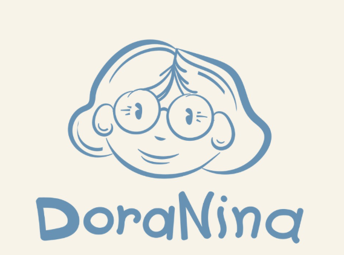

  

<h1 align="center">DoraNina</h1>

  Loja online de bolos artesanais com catalogo, carrinho, pedidos, area do cliente e painel administrativo.

  <a href="https://doranina.vercel.app">Site em producao</a>
  |
  <a href="#funcionalidades">Funcionalidades</a>
  |
  <a href="#rodando-localmente">Rodando localmente</a>
  |
  <a href="#deploy">Deploy</a>

## Visao geral

O projeto da DoraNina foi pensado para apresentar o catalogo da loja, receber pedidos online e centralizar a operacao em um painel simples de administrar. A aplicacao roda em PHP e hoje esta preparada para deploy serverless na Vercel com banco PostgreSQL no Neon.

## Funcionalidades

- Catalogo de produtos com imagens, descricao, preco e destaque visual.
- Carrinho com resumo do pedido antes da finalizacao.
- Cadastro e login de clientes.
- Registro de pedidos no banco com itens detalhados.
- Envio de e-mail automatico quando um pedido e concluido.
- Painel admin para acompanhar pedidos e gerenciar produtos.

## Stack

- PHP com roteamento via `api/index.php`
- PostgreSQL no Neon
- PHPMailer para notificacoes por e-mail
- Vercel com `vercel-php@0.9.0`
- HTML, CSS e JavaScript vanilla no frontend

## Estrutura

- `index.php`: vitrine principal da loja.
- `processar_pedido.php`: finalizacao do pedido e disparo de e-mail.
- `admin/`: dashboard, produtos, pedidos e fluxo do admin.
- `config/`: conexao com banco e configuracao de e-mail.
- `includes/`: cabecalho, rodape, auth e funcoes auxiliares.
- `database/`: schema para PostgreSQL e arquivos de apoio.
- `assets/`: estilos, scripts e imagens da identidade visual.

## Rodando localmente

1. Coloque a pasta em um servidor PHP local, como XAMPP.
2. Configure as variaveis de ambiente com base no arquivo `.env.example`.
3. Para PostgreSQL/Neon, importe `database/neon_postgres.sql` e configure `DATABASE_URL`.
4. Para MySQL local, importe `database/loja_bolos.sql` e configure as variaveis `DB_*`.
5. Abra `http://localhost/doranina`.

## Variaveis de ambiente

- `APP_SECRET`: segredo usado para cookies assinados e autenticacao.
- `DATABASE_URL`: string de conexao principal para PostgreSQL.
- `DB_HOST`, `DB_PORT`, `DB_NAME`, `DB_USER`, `DB_PASSWORD`: alternativa para conexao local com MySQL.
- `SMTP_HOST`, `SMTP_PORT`, `SMTP_USER`, `SMTP_PASS`: credenciais do servidor SMTP.
- `SMTP_FROM_EMAIL`, `SMTP_FROM_NAME`: remetente padrao dos e-mails.
- `EMAIL_PEDIDOS_DESTINO`, `EMAIL_PEDIDOS_NOME`: destino das notificacoes de pedido.

## Deploy

1. Configure `DATABASE_URL` com o banco de producao.
2. Defina `APP_SECRET` com um valor longo e aleatorio.
3. Preencha as variaveis SMTP para ativar os e-mails de pedido.
4. Publique na Vercel ou faca push para o repositorio conectado ao projeto.

## Observacoes

- Sem banco configurado, a home sobe, mas login, painel e pedidos ficam indisponiveis.
- O favicon do navegador usa a propria logo da DoraNina para reforcar a identidade da marca.
